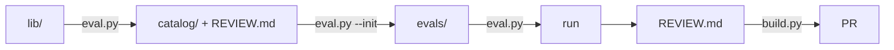

# How to contribute

Two kinds of contribution:
- your own context (skill, MCP, hook, agent or bundle) + `evals/` + `REVIEW.md`;
- `evals/` + `REVIEW.md` for something already in `lib/`.

Write REVIEW.md yourself (an LLM only for a draft): the file must reflect your own thinking

## What a PR may touch

By hand — only `lib/`, `catalog/` and `README.md`; 
Other, `ui/catalog.js` and `.claude-plugin/marketplace.json` come along as `ui/build.py` left them; anything else is a separate PR.

Never push a `REVIEW.md` you have not read: write it or delete it.

## Steps



space

```bash
# 0. view the catalog
python3 ui/build.py && open ui/index.html 

# 1. in lib/: skills/<n>/, mcp/<n>.json ...
cp -r <skill> lib/skills/<name>               

# 2. catalog/skill-<name>/ + REVIEW.md from template/
python3 ui/eval.py lib/skills/<name>          

# 3. cases via the claude plugin eval init interview
python3 ui/eval.py lib/skills/<name> --init    
❗ YOUR TURN: INTERVIEW (with agent)

# 4. run; report in catalog/skill-<name>/evals/results/<ts>/report.html
python3 ui/eval.py lib/skills/<name> 

# 5. write the review, remove draft: true
❗ YOUR TURN: EDITOR catalog/skill-<name>/REVIEW.md        

# 6. rebuild, check
python3 ui/build.py && open ui/index.html  

# 7. PR
git checkout -b add/<name> && git add -A && git commit && gh pr create
```

Only `lib/`, `REVIEW.md` and the cases are written by hand; the rest is built by build, and in a PR `python3 ui/build.py --check` checks it.

## Formats in lib/

```bash
skills/<name>/SKILL.md      # name in frontmatter = folder name; do not edit third-party files, source in REVIEW.md → url
mcp/<name>.json             # server block as in .mcp.json + env_required, source
hooks/<name>/hooks.json     # plugin format, scripts alongside: ${CLAUDE_PLUGIN_ROOT}/hooks/<name>/<script>
agents/<name>.md
plugins/<name>.json         # {"skills": [], "agents": [], "mcp": [], "hooks": []}
```

## REVIEW.md & Evals

Template with comments: 
- [template/REVIEW.md](template/REVIEW.md) 
- [template/evals/](template/evals/)

Example: 
- [catalog/skill-claude-api/REVIEW.md](catalog/skill-claude-api/REVIEW.md).
- [catalog/mcp-context7/evals/](catalog/mcp-context7/evals/) (we keep the last run in git)


## Starting with an agent

You can just paste this into claude code:
```
Read https://github.com/innowise-ai/ai-ml-accelerator/blob/main/CONTRIBUTING.md and walk me through the steps
```
