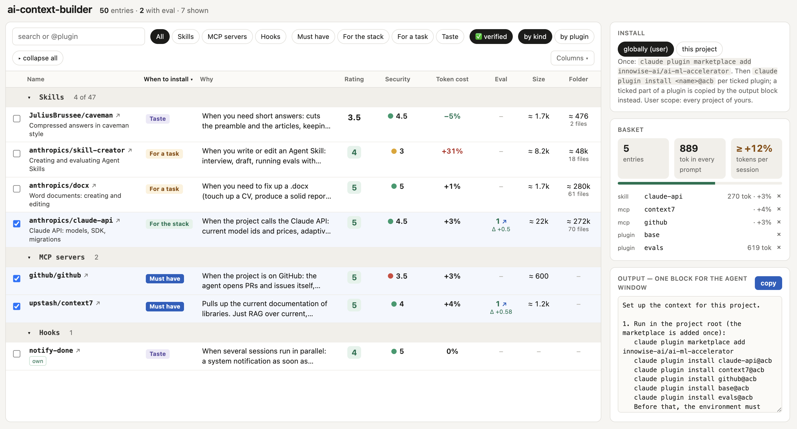

# ai-context-builder

A catalog of vetted context for Claude Code (later for Codex too). Four kinds: skills, MCP servers, hooks, agents, plus bundles of them — plugins. Everything lives in `lib/`. In `catalog/` — reviews: `REVIEW.md` (a human review with notes) and `evals/` (cases that check this skill, MCP or bundle).

To install, it is enough to open `ui/index.html`: a table with verdict, rating, security, token cost and eval result; you tick the entries and get the install commands and the text for the agent window.



## What's in it

| Category | Name | Eval | Review |
|---|---|---|---|
| skill | caveman | — | done · taste |
| skill | claude-api | 1 case · Δ +0.50 | done · stack |
| skill | docx | — | done · task |
| skill | mcp-builder | — | missing |
| skill | skill-creator | — | done · task |
| mcp | context7 | 2 cases · Δ +0.58 | done · must-have |
| mcp | github | — | done · must-have |
| hook | notify-done | — | done · taste |
| agent | — | — | — |
| plugin | base | — | missing |
| plugin | evals | 32 cases · last run incomplete (16 of 32) | missing |
| plugin | langchain | — | missing |
| plugin | qdrant | — | missing |

A plugin is a bundle of parts from `lib/`, so its members are not repeated as rows of their own.
The one overlap is `plugin/base` — it bundles `mcp/context7` and `hook/notify-done`, which are also
entries in their own right. Only an entry with a finished `REVIEW.md` (no `draft: true`) reaches
`ui/index.html` and the marketplace; the rest are listed here as work in progress.

## Run

```bash
# Prompt for the agent:
Clone https://github.com/innowise-ai/ai-ml-accelerator, run the commands from the Readme "##Run" below

# Or by hand:
git clone https://github.com/innowise-ai/ai-ml-accelerator && cd ai-ml-accelerator
python3 ui/build.py && open ui/index.html        # catalog: tick entries → install commands

# Install without the catalog:
claude plugin marketplace add innowise-ai/ai-ml-accelerator
claude plugin install <name>@acb
```

## Layout

```
lib/                              library — added by a human
  skills/<name>/SKILL.md
  agents/<name>.md
  mcp/<name>.json
  hooks/<name>/hooks.json + scripts
  plugins/<name>.json             {"skills": [], "agents": [], "mcp": [], "hooks": []}

catalog/<kind>-<name>/            entry = ready-made plugin
  REVIEW.md                       written by a human
  evals/<case>/                   written by a human: prompt.md, graders/
  evals/results/<ts>/report.html  eval run
  .claude-plugin/plugin.json      automatic
  skills/ agents/ hooks/ .mcp.json  automatic

template/                         templates for REVIEW.md and evals/
.claude-plugin/marketplace.json   built by build: one entry per catalog/ folder with a finished REVIEW.md

ui/
  index.html                      catalog
  catalog.js                      data for index.html, built by build
  build.py                        check lib/ and catalog/, build marketplace.json and catalog.js
  eval.py                         build an entry in catalog/, create cases, run claude plugin eval
```

## Commands

```
python3 ui/build.py && open ui/index.html   view the catalog
python3 ui/eval.py <path in lib> [--init]   build an entry in catalog/, create cases (--init), run eval
python3 ui/build.py [--check]               build marketplace.json and catalog.js; --check for CI
```

How to add an entry — see [CONTRIBUTING.md](CONTRIBUTING.md).
